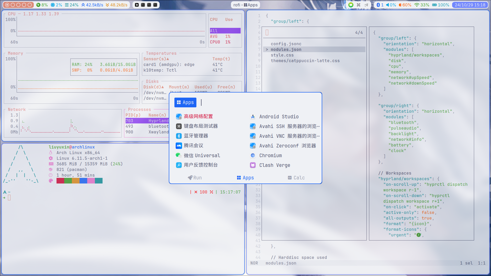
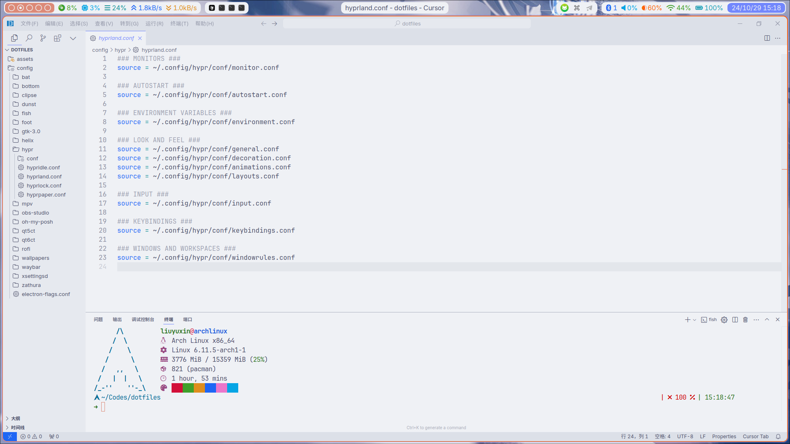

# Archlinux + Hyprland

<div style="display: flex; justify-content: space-between;">
    
    
</div>

# 基础软件安装

```bash
sudo pacman -S --needed base-devel git curl wget zip unzip p7zip rustup
rustup install stable
mkdir -p ~/Downloads && cd ~/Downloads
git clone https://aur.archlinux.org/paru.git
cd paru
makepkg -si
```

# 字体配置

使用 Sarasa UI SC 作为系统字体，前往 [Sarasa-Gothic](https://github.com/be5invis/Sarasa-Gothic) 下载字体后：

```bash
sudo mkdir -p /usr/share/fonts/sarasa-ui-sc
7z e SarasaUiSC-TTF-1.0.22.7z
sudo mv *.ttf /usr/share/fonts/sarasa-ui-sc
fc-cache -f -v
```

其他字体：

```bash
paru -S --needed adobe-source-han-sans-cn-fonts adobe-source-han-serif-cn-fonts \
    inter-font noto-fonts noto-fonts-cjk noto-fonts-emoji ttf-font-awesome \
    ttf-jetbrains-mono ttf-jetbrains-mono-nerd ttf-liberation \
    ttf-nerd-fonts-symbols ttf-nerd-fonts-symbols-common
```

配置系统字体：

```bash
sudo cp ./etc/fonts/local.conf /etc/fonts/local.conf
```

# Hyprland 配置

配置文件：

```bash
cp -r ./.config/* ~/.config/
cp ./.gtkrc-2.0 ~/.gtkrc-2.0
cp ./Xresources ~/.Xresources
```

Hyprland 工具：

```bash
paru -S --needed hyprpaper hyprpicker hyprlock
```

状态栏：

```bash
paru -S --needed waybar
```

系统通知：

```bash
paru -S --needed dunst
```

启动器：

```bash
paru -S --needed rofi rofi-calc
```

终端：

```bash
paru -S --needed foot
```

Shell 配置：

```bash
paru -S --needed fish
fish_config theme save "Catppuccin Latte"
curl -s https://ohmyposh.dev/install.sh | bash -s
chsh -s /usr/bin/fish
sudo chsh -s /usr/bin/fish
```

终端工具：

```bash
paru -S --needed bat bottom fastfetch helix zoxide
```

输入法：

```bash
paru -S --needed fcitx5 fcitx5-chinese-addons fcitx5-configtool
paru -S --needed catppuccin-fcitx5-git
```

剪切板管理：

```bash
paru -S --needed clipse
```

浏览器：

```bash
paru -S --needed chromium zen-browser-bin
```

媒体管理：

```bash
paru -S --needed mpv obs-studio
```

PDF 阅读器：

```bash
paru -S --needed zathura zathura-pdf-mupdf
```

Cursor 主题：

```bash
paru -S --needed bibata-cursor-theme-bin
```

GTK 主题：

```bash
paru -S --needed colloid-catppuccin-gtk-theme-git nwg-look
```

QT 主题：

```bash
paru -S --needed qt5ct qt6ct
```

SDDM 主题配置：

```bash
sudo cp ./etc/share/sddm/themes/where_is_my_sddm_theme/ /usr/share/sddm/themes/
sudo cp ./etc/sddm.conf /etc/sddm.conf
```
